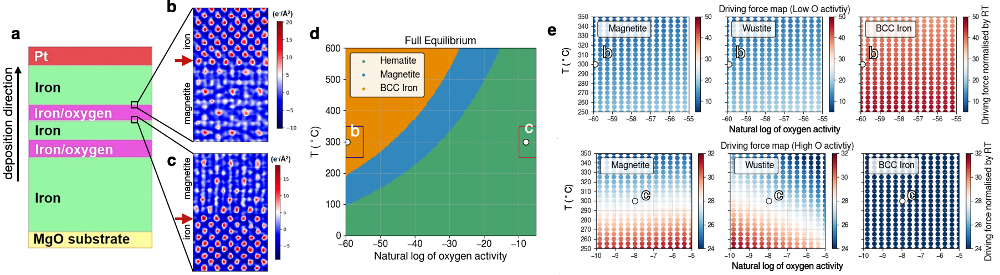
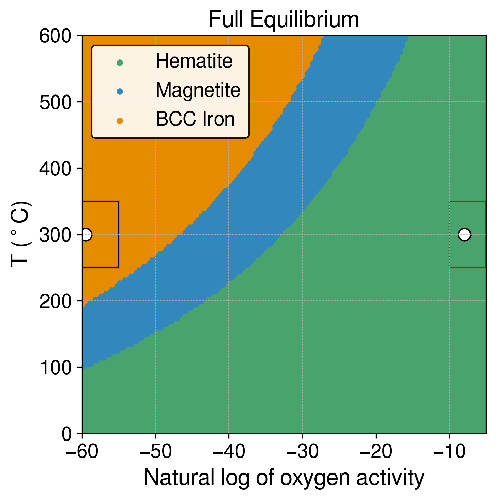
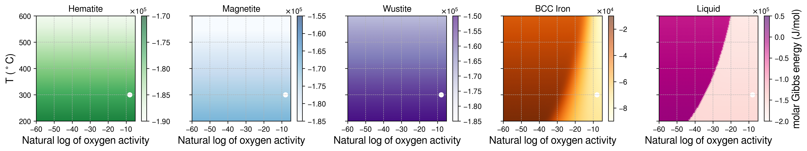
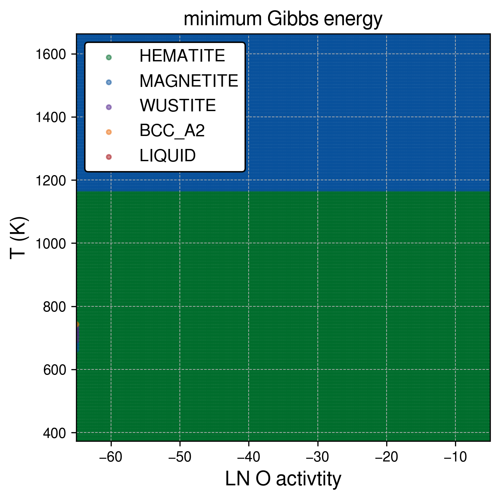
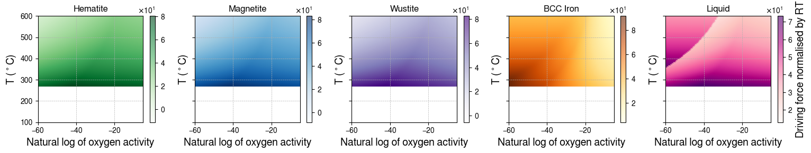
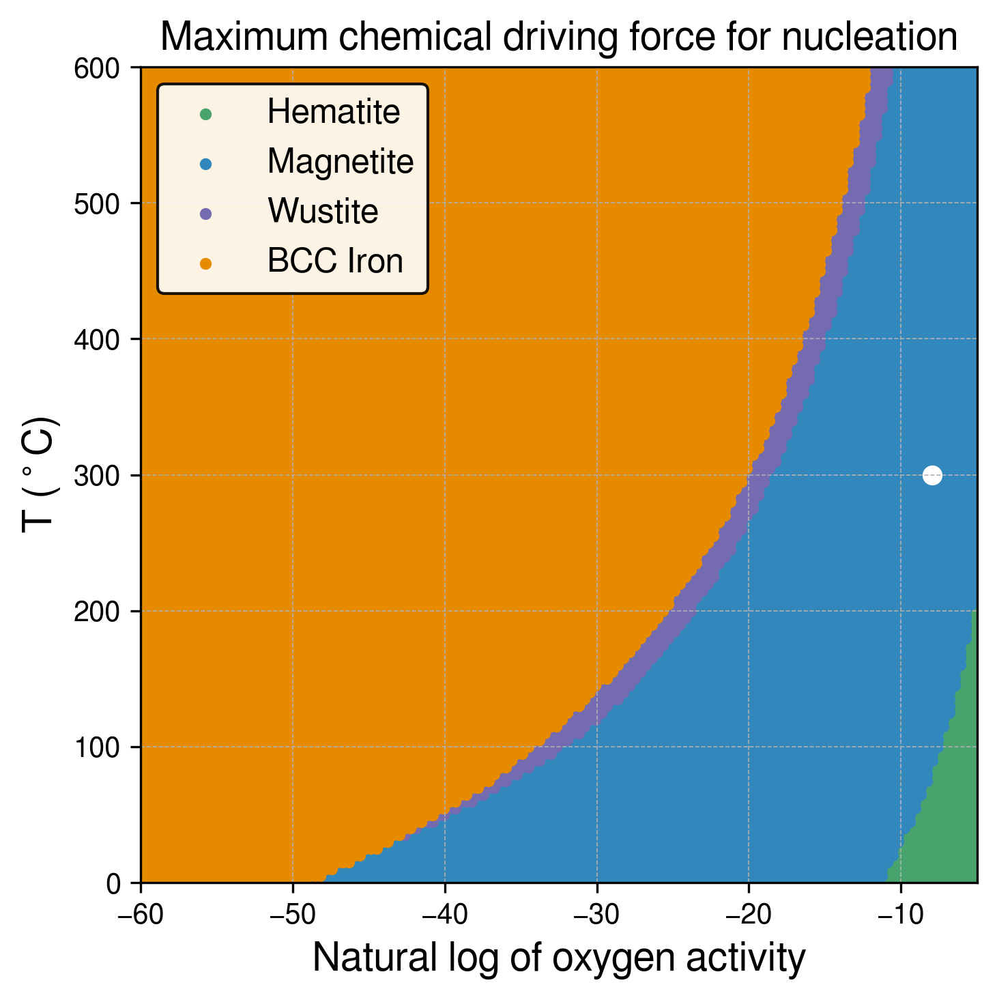

# IronOxide_TC

<!-- ## Updates 2023-10-15

Now in Jupyter Notebook.

I have tried to implement the three types of Gibbs energy assessments: Full Equilibrium, Molar Gibbs Energy, and Driving Force against the gas phase (normalised).

Still need to have another check to ensure the calculations are 100% consistent with Console mode and to determine if we need to try other databases.

- Pressure = 0.5 Pa (5e-6 bar) and only Fe and O
- Plotting as T(K) and ln(Oxygen activity): referenced to the oxygen gas phase at each temperature -->

## Introduction

Parellsied computational thermodynaics calculation to understand the bulk thermodyanbamics of regarding phase transformation between iron and iron oxide ploymorphs.

The presenet context is regarding the physical vapoubour depsotion of BCC iron and Hematite, Magneitte, Wustite etc in the Fe-O system.

The free energy functions are evaluated in 2 way:

I have tried to implement the three types of Gibbs energy assessments: Full Equilibrium, and chemical Driving Force for the nucleation of iron oxide/iron against the gas phase (normalised).

Still need to have another check to ensure the calculations are 100% consistent with Console mode and to determine if we need to try other databases.

- Pressure = 0.5 Pa (5e-6 bar) and only Fe and O
- Plotting as T(K) and ln(Oxygen activity): referenced to the oxygen in gas phase at each temperature

We performed the computational thermodynamic calcualtios using the CALculation of PHAse Diagrams (CALPHAD) methods regarding the phase transformation between iron and iron oxide ploymorphs. We examine two aspectsL: 1) the equialibrium phase stability

## Notebook and macro

- See `IronOxide_TC_sublattice.ipynb` for full calculations and visualisations. This notebook is based on Gibbs energy evaluations using sublattice models (oxides are treated as solution phase). Free energy is taken from the TCFE13 database.

- One may also check out `IronOxide_TC_stoichiometric.ipynb`, which uses the free energy for oxides from the SSUB substance database. In this case, the oxides are treated as stoichiometric compounds.

- Some Thermo-Calc macros for console mode are included in the `./TC macro` directory.

<!-- In the realm of materials science, particularly when examining oxides, understanding thermodynamic properties is essential. These properties are especially critical for applications such as corrosion resistance in aqueous environments under atmospheric conditions.

There are two categories of oxides in focus: stoichiometric and non-stoichiometric. Stoichiometric oxides have fixed compositions, while non-stoichiometric oxides exhibit variable composition. Theoretical models like Gibbs free energy often help in describing the thermodynamic features of these materials.

### Stoichiometric Oxides

In stoichiometric oxides, the Gibbs free energy is often solely dependent on temperature within certain temperature ranges. Researchers typically use this temperature-dependence to derive specific coefficients that describe thermal properties. These coefficients are either experimentally determined or computed using first-principles calculations.

### Non-stoichiometric Oxides

For non-stoichiometric oxides, things get a bit more complicated due to their 'solution-like' nature, meaning they can exist in various compositions. The Gibbs free energy in this case is calculated using models that consider sublattices—essentially, small sections of the overall crystal structure where particular atoms or ions reside. These models account for multiple aspects, such as:

1. The unreacted elements in their most stable states.
2. Entropy contributions, which represent the degree of disorder within the system.
3. Interaction energies between constituents, which could be temperature-dependent.

These components are generally determined by computational methods and offer valuable insights into phenomena like phase stability and transformation pathways in these materials.

By fully understanding both the stoichiometric and non-stoichiometric oxides' thermodynamic properties, researchers can better predict material behavior under various conditions, offering the potential for improved material design. -->

## Dependencies

- **tc-python by Thermo-Calc**
- **TCFE Database**: Using the TCFE13 database for the Corundum, Spinel, Halite, BCC, and Gas phases. The new Gas phase evaluation for the Fe-O system seems to be the same as that in the SSUB database.
- **SSUB Database**: Using the SSUB5 database for the Hematite, Magnetite, Wüstite, and Gas phases.

## Visuals

#### Full Equilibrium phase diagram as a function of temperature and O activity

  
#### Gibbs energy of phases as a function of temperature and O activity

<!-- #### Minimum Gibbs energy diagram

 -->

#### Driving force of phases (against gas phase) as a function of temperature and O activity

#### Maximum Driving Force diagram

The small white dot shows the physical vapour deposition condition, which can be calculated from the Thermo-Calc macro: `tc_O_activity.TCM`.

