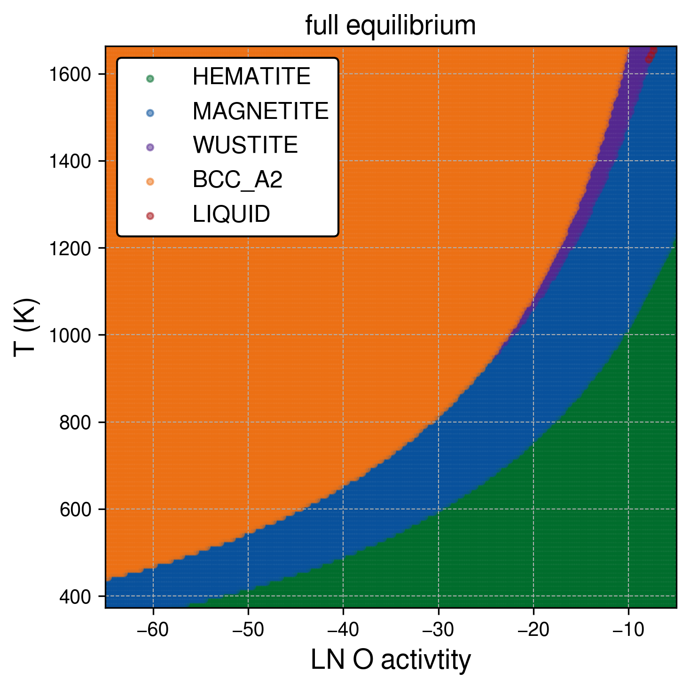
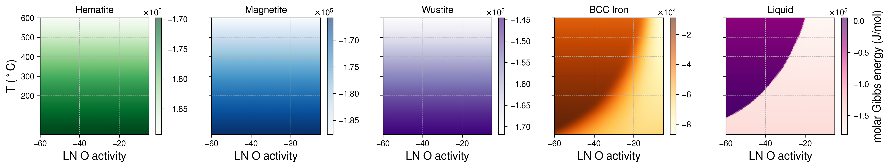
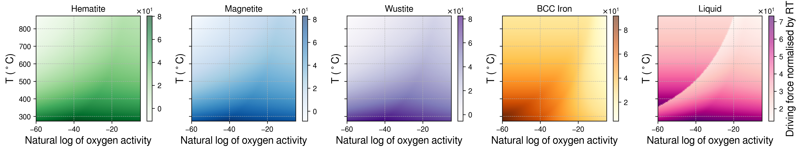

# IronOxide_TC

just implemented to map the full equilibrium regimes as a function of temperature and O activity

- Pressure = 0.5Pa (5e-6 bar) and only Fe and O
- plotting as T(K) and ln(Oxygen activity): referenced to the Oxygen gas at each temperature
- (we can update the choice of databse later)

## Notebook

- see `IronOxide_TC_calculations.ipynb` for full calculations and visualisations.

## Dependencies

- **tc-python and Thermo-Calc**
- **TCFE**: using the TCFE11 database for the BCC and Liquid phases.
- **SSUB**: Using the SSUB5 database for the HEMATITE, MAGNETITE, and WUSTITE phases.

## Visuals

#### Full Equilibrium phase diagram as a function of temperature and O activity

  
#### Gibbs energy of phases as a function of temperature and O activity

<!-- #### minimum Gibbs energy diagram

 -->

#### Driving force of phases (against gas) as a function of temperature and O activity

#### Maximum Driving force diagram

