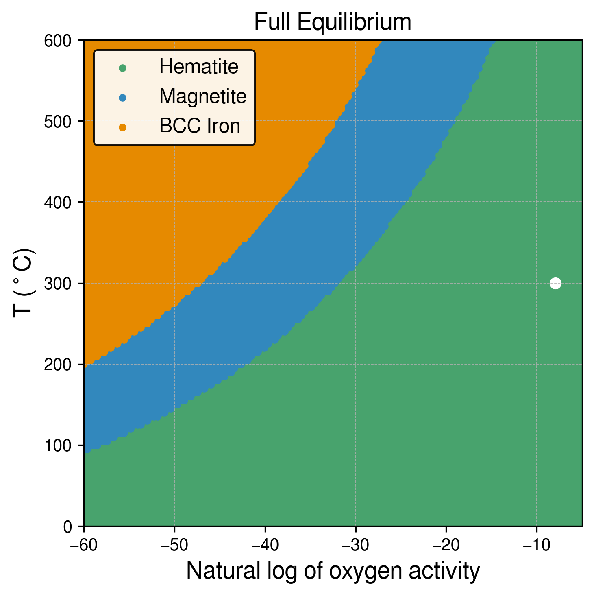

# IronOxide_TC

## Updates 2023-10-1

Now in Jupyter Notebook.

I have tried to implement the three types of Gibbs energy assessments: Full Equilibrium, Molar Gibbs Energy, and Driving Force against the gas phase (normalised).

Still need to have another check to ensure the calculations are 100% consistent with Console mode and to determine if we need to try other databases.

- Pressure = 0.5 Pa (5e-6 bar) and only Fe and O
- Plotting as T(K) and ln(Oxygen activity): referenced to the oxygen gas phase at each temperature

## Introduction

Parellsied computational thermodynaics calculation to understand the bulk thermodyanbamics of regarding phase transformation between iron and iron oxide ploymorphs.

The presenet context is regarding the physical vapoubour depsotion of BCC iron and Hematite, Magneitte, Wustite etc in the Fe-O system.

The free energy functions are evaluated in 2 way:

I have tried to implement the three types of Gibbs energy assessments: Full Equilibrium, Molar Gibbs Energy, and Driving Force against the gas phase (normalised).

Still need to have another check to ensure the calculations are 100% consistent with Console mode and to determine if we need to try other databases.

- Pressure = 0.5 Pa (5e-6 bar) and only Fe and O
- Plotting as T(K) and ln(Oxygen activity): referenced to the oxygen gas phase at each temperature

## Notebook

- See `IronOxide_TC_calculations.ipynb` for full calculations and visualisations.

## Dependencies

- **tc-python by Thermo-Calc**
- **TCFE**: Using the TCFE11 database for the BCC and Liquid phases.
- **SSUB**: Using the SSUB5 database for the HEMATITE, MAGNETITE, and WUSTITE phases.

## Visuals

#### Full Equilibrium phase diagram as a function of temperature and O activity

  
#### Gibbs energy of phases as a function of temperature and O activity

<!-- #### Minimum Gibbs energy diagram

 -->

#### Driving force of phases (against gas phase) as a function of temperature and O activity

#### Maximum Driving Force diagram

The small white dot shows the physical vapour deposition condition, which can be calculated from the Thermo-Calc macro: `tc_O_activity.TCM`.

