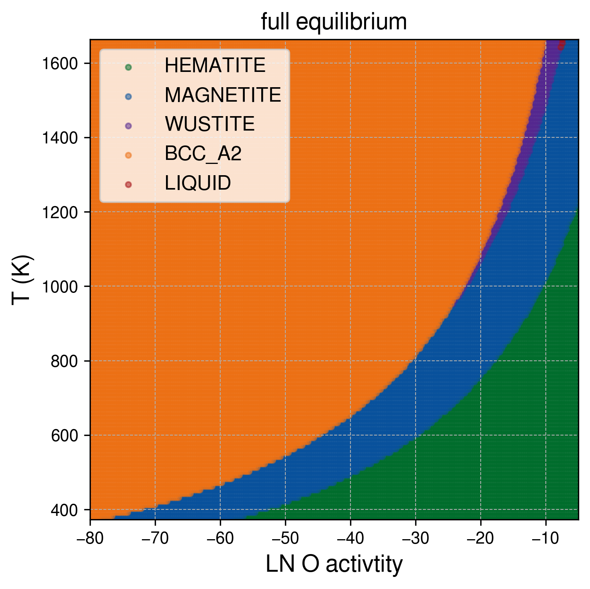
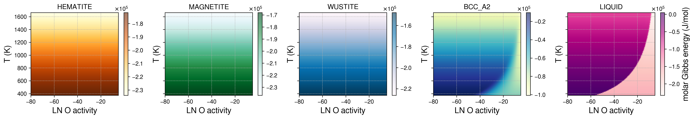
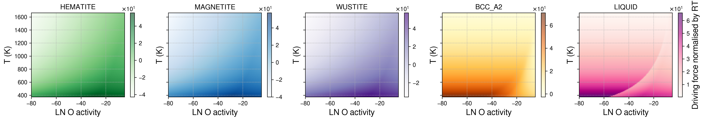
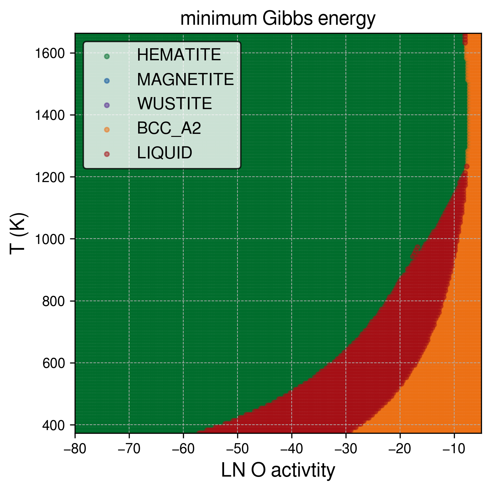

# Oxide_TC

just implemented to map the full equilibrium regimes as a function of temperature and O activity

- Pressure = 0.5Pa (5e-6 bar) and only Fe and O
- used the BCC and Liquid phase from the TCFE11 database
- used HEMATITE, MAGNETITE and WUSTITE phase from the SSUB5 database
- plotting as T(K) and ln(Oxygen activity): referenced to the Oxygen gas at each temperature
- (we can update the choice of databse later)

see `Oxide_TC_equilibrium.ipynb`

## Visuals

#### Full Equilibrium phase diagram as a function of temperature and O activity

  
#### Gibbs energy of phases as a function of temperature and O activity

<!-- #### minimum Gibbs energy diagram

 -->

#### Driving force of phases (against gas) as a function of temperature and O activity

#### minimum Driving force diagram

