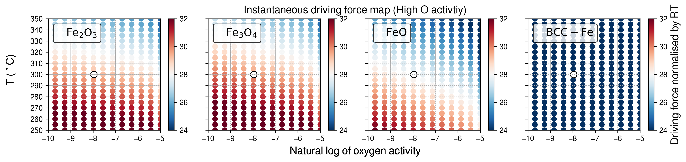

# IronOxide_TC

<!-- ## Updates 2023-10-15

Now in Jupyter Notebook.

I have tried to implement the three types of Gibbs energy assessments: Full Equilibrium, Molar Gibbs Energy, and Driving Force against the gas phase (normalised).

Still need to have another check to ensure the calculations are 100% consistent with Console mode and to determine if we need to try other databases.

- Pressure = 0.5 Pa (5e-6 bar) and only Fe and O
- Plotting as T(K) and ln(Oxygen activity): referenced to the oxygen gas phase at each temperature -->

## Introduction

We conducted computational thermodynamic analyses using the CALPHAD (Calculation of Phase Diagrams) approach to study the phase equilibria involving iron, various iron oxide polymorphs, and gases during PVD (Physical Vapor Deposition) synthesis. Our study comprises two types of Gibbs energy evaluations. The first type involves the full equilibrium calculations, mapping out stable phases as functions of both temperature and oxygen activity. The second type focuses on the nucleation driving force, which represents the energetic shift in the system when an infinitesimal amount of solid phase (either iron or an iron oxide) is deposited from a supersaturated gas phase. This was also examined as a function of temperature and oxygen activity.

We referenced the oxygen activity to that in the gas phase at each specified temperature, under standard atmospheric conditions. It is assumed that the PVD experiments were at a constant level of oxygen activity, with the atmospheric conditions being a mixture of argon and oxygen. We labelled the plots with oxygen activities corresponding to the experimental condition, which corresponds to a volumetric flow rate ratio of 40/2 for argon and oxygen at a pressure of 0.5 Pa (5e-6 bar).

We have used the Gibbs energy assessments of the solution phase of iron, hematite (corundum phase), magnetite (spinel phase), and wüstite (halite phase), BCC iron, and the gas phase, from the TCFE13 database of Thermo-Calc. Parallelised calculations were performed via the tc-python API by Thermo-Calc. Additional details can be found in our GitHub repository: (https://github.com/YXWU2014/IronOxide_TC).

## Notebook and macro

- See `IronOxide_TC_sublattice.ipynb` for full calculations and visualisations. This notebook is based on Gibbs energy evaluations using sublattice models (oxides are treated as solution phase). Free energy is taken from the TCFE13 database.

- One may also check out `IronOxide_TC_stoichiometric.ipynb`, which uses the free energy for oxides from the SSUB substance database. In this case, the oxides are treated as stoichiometric compounds.

- Some Thermo-Calc macros for console mode are included in the `./TC macro` directory.

<!-- In the realm of materials science, particularly when examining oxides, understanding thermodynamic properties is essential. These properties are especially critical for applications such as corrosion resistance in aqueous environments under atmospheric conditions.

There are two categories of oxides in focus: stoichiometric and non-stoichiometric. Stoichiometric oxides have fixed compositions, while non-stoichiometric oxides exhibit variable composition. Theoretical models like Gibbs free energy often help in describing the thermodynamic features of these materials.

### Stoichiometric Oxides

In stoichiometric oxides, the Gibbs free energy is often solely dependent on temperature within certain temperature ranges. Researchers typically use this temperature-dependence to derive specific coefficients that describe thermal properties. These coefficients are either experimentally determined or computed using first-principles calculations.

### Non-stoichiometric Oxides

For non-stoichiometric oxides, things get a bit more complicated due to their 'solution-like' nature, meaning they can exist in various compositions. The Gibbs free energy in this case is calculated using models that consider sublattices—essentially, small sections of the overall crystal structure where particular atoms or ions reside. These models account for multiple aspects, such as:

1. The unreacted elements in their most stable states.
2. Entropy contributions, which represent the degree of disorder within the system.
3. Interaction energies between constituents, which could be temperature-dependent.

These components are generally determined by computational methods and offer valuable insights into phenomena like phase stability and transformation pathways in these materials.

By fully understanding both the stoichiometric and non-stoichiometric oxides' thermodynamic properties, researchers can better predict material behavior under various conditions, offering the potential for improved material design. -->

## Dependencies

- **tc-python by Thermo-Calc**
- **TCFE Database**: Using the TCFE13 database for the Corundum, Spinel, Halite, BCC, and Gas phases. The new Gas phase evaluation for the Fe-O system seems to be the same as that in the SSUB database.
- **SSUB Database**: Using the SSUB5 database for the Hematite, Magnetite, Wüstite, and Gas phases.

## Visuals

### Full Equilibrium phase diagram as a function of temperature and O activity

  
### Gibbs energy of phases as a function of temperature and O activity

### Nucleation Driving force of depositing phases (from gas phase) as a function of temperature and O activity

using solution phase of oxides from TCFE13

using stoichiometric phase of oxides from SSUB5 (overall landscape looks very similar as above solution phases)

### Driving Force diagram: zoom in

High oxygen activity condition (**solution phase**): small dot shows the physical vapour deposition condition (`./TC_macro/tc_O_activity.TCM`).

High oxygen activity condition (**stoichiometric phase**)

Low oxygen activity condition:

### Maximum nucleation driving force diagram.

**using solution phase of oxides from TCFE13 (all phases)**

**using solution phase of oxides from TCFE13 (comparing Magnetite vs. Wustite)**

**using stoichiometric phase of oxides from SSUB5 (all phases)**

**using stoichiometric phase of oxides from SSUB5 (comparing Magnetite vs. Wustite)**

