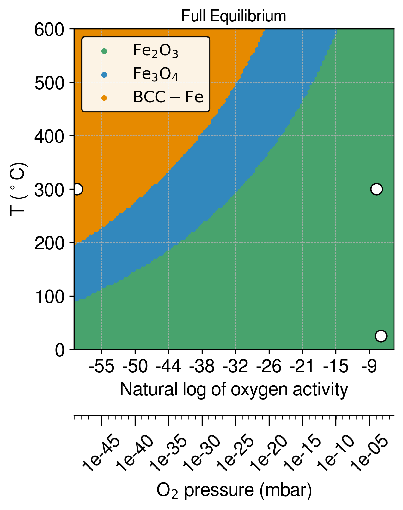

# IronOxide_TC

## Introduction

We conducted computational thermodynamic analyses using the CALPHAD (Calculation of Phase Diagrams) approach to study the phase equilibria involving iron, various iron oxide polymorphs, and gases for the PVD (Physical Vapor Deposition) synthesis. Our study comprises two types of Gibbs energy evaluations:

1. **Full Equilibrium Calculations**: These map out stable phases as functions of both temperature and oxygen activity.
2. **Nucleation Driving Force**: This represents the energetic shift in the system when an infinitesimal amount of solid phase (either iron or an iron oxide) is deposited from a supersaturated gas phase. This was also examined as a function of temperature and oxygen activity.

We referenced the oxygen activity to that in the gas phase at each specified temperature, under standard atmospheric conditions. The PVD experiments are assumed to have been conducted at a constant level of oxygen activity, with the atmospheric conditions being a mixture of argon and oxygen.

**Experimental Conditions**

We labelled the plots with oxygen activities corresponding to the experimental conditions:

- **BCC iron-forming condition**: At an infinitesimal oxygen activity at 300°C.
- **Experimental magnetite-forming condition**: Corresponds to a volumetric flow rate ratio of 40/2 for argon and oxygen at 300°C.
- **Experimental hematite-forming condition**: Corresponds to a volumetric flow rate ratio of 40/10 for argon and oxygen at 25°C.

All PVD experiments were conducted at a pressure of 0.5 Pa (5 x 10^-3 mbar).

**Databases and Calculations**

We used the Gibbs energy assessments of BCC iron from the TCFE13 database, as well as hematite, magnetite, and wüstite, and the gas phase, from the SSUB5 database of Thermo-Calc. Parallelised calculations were performed via the tc-python API by Thermo-Calc.

## Notebook and macro

- See `IronOxide_TC_stoichiometric.ipynb` for full calculations and visualisations. It uses the free energy for oxides from the SSUB substance database. In this case, the oxides are treated as stoichiometric compounds.

- One may also check out `IronOxide_TC_sublattice.ipynb`. This notebook is based on Gibbs energy evaluations using sublattice models (oxides are treated as solution phase). Free energy is taken from the TCFE13 database.

- Some Thermo-Calc macros for console mode are included in the `./TC macro` directory.

## Visuals

### Full Equilibrium phase diagram as a function of temperature and O activity

### Nucleation Driving force of depositing phases (from gas phase) as a function of temperature and O activity

### Driving Force diagram: zoom in

Low oxygen activity condition: small dot shows the physical vapour deposition condition (`./TC_macro/tc_O_activity.TCM`).

High oxygen activity condition:

### Maximum nucleation driving force diagram.

